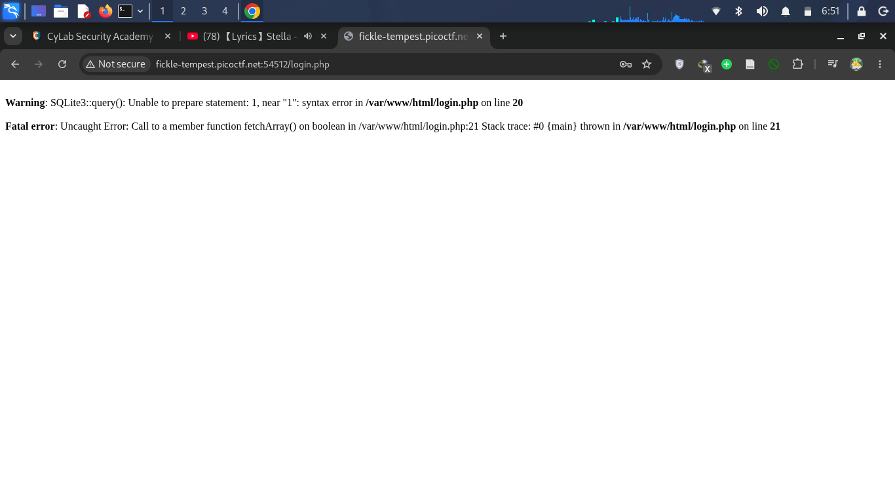
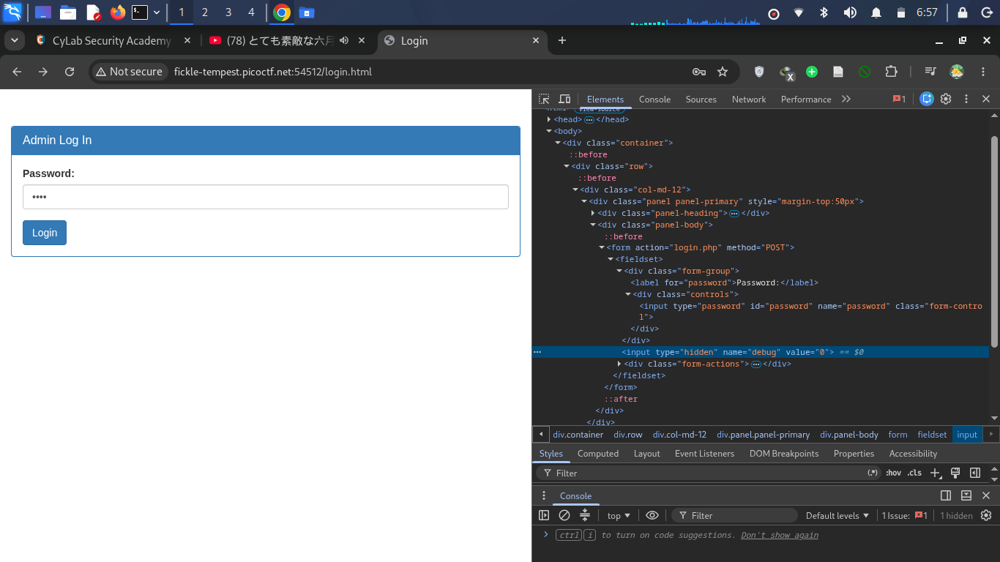
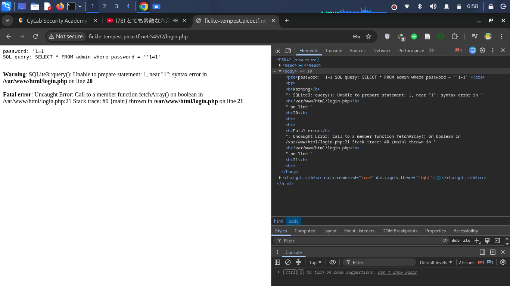
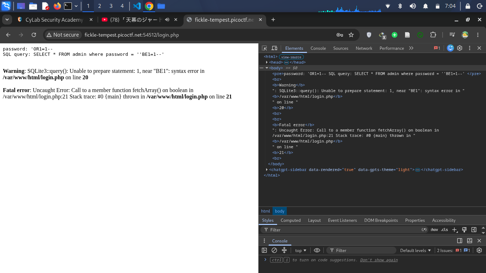

# Write-up: [Irish-Name-Repo 3](https://learn.cylabacademy.org/learning-paths/7/66) (cylabacademy)

- **Category   :** Web Exploitation
- **Difficulty :** Medium
- **Author     :** Xingyang Pan
- **Written by :** Lim Almadyuni (Limath)
---

## Executive Summary
Coba kita menggunakan SQL Injection dulu yaitu ```' OR 1=1 --```, dan nanti hasilnya akan seperti ini.



Dapat diketahui bahwa web ini dapat diretas menggunakan SQL Injection biasa, tapi seharusnya sudah selesai kan? Kok ini gak nampilin flag? Oke jadi kita baca hint nya dulu. ```Seems like the password is encrypted.```, brarti passwordnya dienkripsi, maka dari itu, kita perlu tahu apa jenis enkripsi yang digunakan. Coba kita inspect, siapa tau ada petunjuk. Dan ternyata ada Debug, yang value nya 0



coba kita rubah ke 1, apakah nanti ada efek?. Setelah merubah, coba gunakan SQLi umum dulu.



Ternyata muncul SQL Query, dimana akan diperlihatkan perilaku web jika kita menginput password. Ini sangat penting mengingat dari hint, password nya ter enkripsi.

Selanjutnya coba kita masukkan a hingga z


Kita diperlihatkan bahwa panjang barisnya sama persis antara terenkripsi dengan flag kita. Dari pola itu kita bisa mengetahui bahwa password di enkripsi menggunakan ROT13 (Caesar Chiper Shift 13). Tapi ada satu pertanyaan, apakah kode (non-string) juga ikut terenkripsi, harusnya kalo gak terenkripsi kan walau kita dengan SQLi umum ya langsung bisa? makanya disini akan di cek SQLi umum lagi ```' OR 1=1 --```. Dan hasilnya seperti ini



Ternyata, ```OR``` menjadi ```BE``` disana yang berarti juga ikut terenkripsi. Karena ROT13 bersifat dua arah, atau enkripsi 2 kali akan menghasilkan dekripsi, maka kita tinggal ketik  ```' BE 1=1 --``` dan flag akan muncul
## Flag
```picoCTF{3v3n_m0r3_SQL_2af58a67}```
